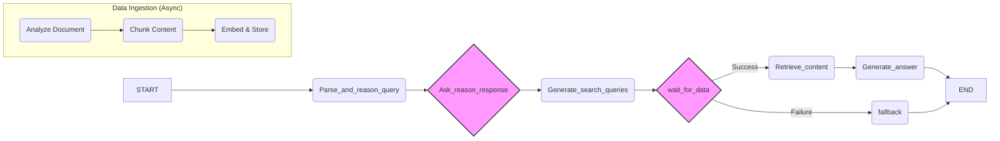

# Contextual RAG: An Advanced, Interactive Document Q&A System

<!-- Optional: Add some badges for a professional look -->


This project implements a sophisticated **Contextual Retrieval-Augmented Generation (C-RAG)** system built with Python and LangGraph. It moves beyond simple document retrieval by creating a stateful, interactive agent that engages with the user to deeply understand their query's context before providing a final, evidence-based answer.

The core architectural goal is to solve two major challenges in traditional RAG systems: **query ambiguity** and **data processing latency**. We achieve this through a multi-step reasoning graph and a highly efficient asynchronous workflow, resulting in a system that is both more accurate and significantly more responsive.

## Key Features

*   **Stateful, Multi-Step Reasoning with LangGraph**
    *   The system's logic is modeled as a stateful graph, not a simple linear chain. This allows for complex operations like dynamic query analysis, conditional branching, and human-in-the-loop interruptions, creating a truly robust and intelligent agent.

*   **Concurrent Data Ingestion & User Interaction**
    *   To eliminate user wait times, the system leverages Python's `asyncio` to run the time-consuming data ingestion process (document parsing, chunking, and embedding) in the background. The user can immediately start interacting with the system and answering clarifying questions while their document is being indexed.

*   **Interactive Context Gathering (Human-in-the-Loop)**
    *   Instead of guessing the user's intent, the system first analyzes the initial query to identify ambiguities. It then enters an interactive loop, asking the user targeted questions to gather the necessary context. This ensures the subsequent retrieval is based on a complete and accurate understanding of the user's needs.

*   **Advanced Document Processing & Retrieval**
    *   Utilizes Azure Document Intelligence to parse complex PDF layouts, including tables and figures, ensuring no information is lost.
    *   Employs a two-stage retrieval process: an initial vector search in ChromaDB followed by a high-precision reranking step with Cohere's Rerank API to find the most relevant context for the final answer.

## Tech Stack

*   **Orchestration:** LangChain & LangGraph
*   **LLMs & Embeddings:** Google Gemini & Cohere
*   **Vector Database:** ChromaDB
*   **Document Parsing:** Azure Document Intelligence
*   **Concurrency:** Python `asyncio`
*   **Observability:** LangSmith

## Workflow Architecture

The system operates as a stateful graph managed by LangGraph. The state is passed between nodes, each performing a specific task.



1.  **`Parse_and_reason_query`**: Analyzes the initial user query to generate clarifying questions.
2.  **`Ask_reason_response`**: Pauses the graph to ask the user for more information (Human-in-the-Loop).
3.  **`Generate_search_queries`**: Synthesizes the user's answers into optimized queries for the vector database.
4.  **`wait_for_data` (Conditional Node)**: Acts as a gate. It waits for the asynchronous data ingestion task to complete successfully before allowing the graph to proceed. If ingestion fails, it routes to a fallback node.
5.  **`Retrieve_content`**: Retrieves relevant document chunks using vector search and reranks them for quality.
6.  **`Generate_answer`**: Uses the retrieved context to generate the final, evidence-based answer.
7.  **`fallback`**: A terminal node that provides an error message if the workflow cannot be completed.

## Setup and Installation

Follow these steps to set up and run the project locally.

### 1. Clone the Repository

```bash
git clone https://github.com/Vikas-ai56/Contextual_RAG.git
cd Contextual_RAG
```

### 2. Create a Virtual Environment

It's recommended to use a virtual environment to manage dependencies.

```bash
# For Windows
python -m venv venv
.\venv\Scripts\activate

# For macOS/Linux
python3 -m venv venv
source venv/bin/activate
```

### 3. Install Dependencies

Install all required packages from the `requirements.txt` file.

```bash
pip install -r requirements.txt
```

### 4. Configure Environment Variables

Create a `.env` file in the root directory by copying the example file.

```bash
# For Windows
copy .env.example .env

# For macOS/Linux
cp .env.example .env
```

Now, open the `.env` file and fill in your API keys and other credentials for the following services:
*   `DOCUMENT_INTELLIGENCE_API_KEY` & `ENDPOINT`
*   `COHERE_API_KEY`
*   `CHROMA_TOKEN`, `TENANT`, `DATABASE`
*   `GOOGLE_API_KEY`
*   `LANGSMITH_API_KEY`, `ENDPOINT`, `PROJECT` (for tracing)

## How to Run

Execute the `main.py` script from the root directory. The application will start the data ingestion process and begin the interactive Q&A session in your terminal.

```bash
python main.py
```

The final generated answer will be printed to the console and saved to `output/output.md`.
